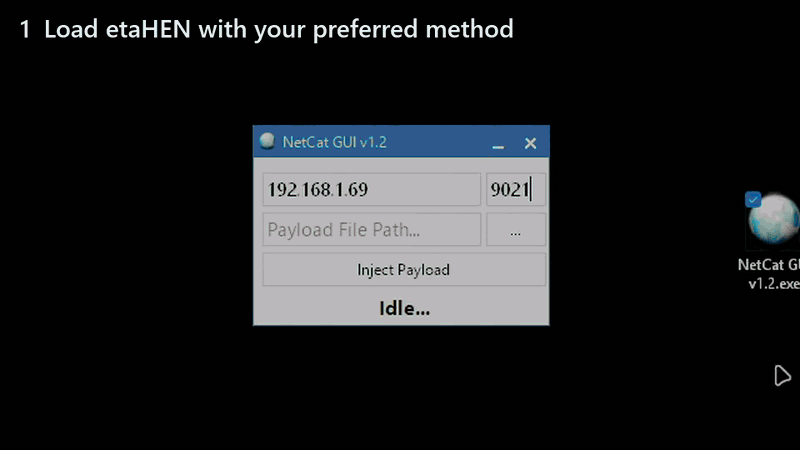
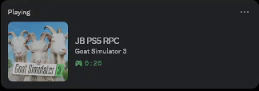

<p align="center"></p>

<h1 align="center">ps5-rpc</h1>

<p align="center">Show what you're playing on your jailbroken PS5 as Discord Rich Presence.</p>

A small tray app that watches your PS5 for the running game and sets your Discord
status (box art, elapsed time, optional "View game" button). One ~1.9 MB binary,
no Python or Docker.

By default it reads the game from etaHEN's RPC server (port 8000) and falls back
to ps5debug-NG (port 744) if the RPC isn't enabled. No etaHEN? The small
[ps5-rpc payload](#no-etahen-use-the-payload) does the same job as etaHEN's RPC.

<p align="center"></p>

On Discord it looks like this:

<p align="center"></p>

## Features

- Tray app with status, Reconnect, Open config folder, and a "Start on login" toggle.
- Two title sources with automatic fallback (etaHEN RPC ↔ ps5debug).
- Handles games whose process isn't `eboot.bin` (e.g. Minecraft LCE).
- Box art + names from orbispatches (PS4) / prosperopatches (PS5), cached locally.
- Your friends see "Playing <game>" in the member list, and PS4 games are marked
  as such.
- Clears your status when the PS5 turns off or drops off the network.
- Works out of the box with a shared Discord app; no Developer Portal needed.

## Download

From the [latest release](https://github.com/smokeyxd/ps5-rust-rpc/releases/latest):

| System | File |
|--------|------|
| Windows | [`ps5-rpc-windows-x64.exe`](https://github.com/smokeyxd/ps5-rust-rpc/releases/latest/download/ps5-rpc-windows-x64.exe) |
| Linux (x64) | [`ps5-rpc-linux-x64`](https://github.com/smokeyxd/ps5-rust-rpc/releases/latest/download/ps5-rpc-linux-x64) |
| macOS (Apple Silicon and Intel) | [`ps5-rpc-macos-universal`](https://github.com/smokeyxd/ps5-rust-rpc/releases/latest/download/ps5-rpc-macos-universal) |
| PS5 payload, only if you don't use etaHEN's RPC | [`ps5-rpc.elf`](https://github.com/smokeyxd/ps5-rust-rpc/releases/latest/download/ps5-rpc.elf) ([what it is](#no-etahen-use-the-payload)) |

On Linux and macOS, make the file executable first (`chmod +x ps5-rpc-linux-x64`).
Linux needs GTK 3, libxdo and an AppIndicator library, which most desktop distros
already have.

The builds aren't code-signed. On Windows, SmartScreen may warn the first time
(**More info** → **Run anyway**). On macOS, run
`xattr -d com.apple.quarantine ps5-rpc-macos-universal` once, or allow it under
System Settings → Privacy & Security. `SHA256SUMS.txt` on each release lists the
checksums.

## Build

```
cargo build --release
```

Output: `target/release/ps5-rpc(.exe)`. Debug builds keep a console for logs;
release builds run windowless.

The payload needs the [PS5 payload SDK](https://github.com/ps5-payload-dev/sdk):
`make -C payload PS5_PAYLOAD_SDK=/opt/ps5-payload-sdk` on Linux or macOS, or
`payload\build.ps1 -Sdk C:\path\to\ps5-payload-sdk` on Windows (needs LLVM).

## Setup

1. Run the app once. It looks for your PS5 on the network and writes a config
   file. If the tray says it can't reach the PS5, put the console's IP in
   `ps5_ip` in `config.json`. The tray's **Open config folder** opens the right
   place:
   - Windows: `%APPDATA%\jbps5\ps5-rpc\config\config.json`
   - Linux: `~/.config/ps5-rpc/config.json` (or `$XDG_CONFIG_HOME/ps5-rpc/` if set)
   - macOS: `~/Library/Application Support/dev.jbps5.ps5-rpc/config.json`
   ```json
   {
     "ps5_ip": "YOUR_PS5_IP",
     "ps5_debug_port": 744,
     "discord_app_id": "",
     "buttons": true,
     "poll_interval_secs": 15,
     "use_etahen_rpc": true,
     "etahen_rpc_port": 8000
   }
   ```
2. Make sure the Discord desktop app is open and one of these is running on the
   console: etaHEN's RPC ([how to turn it on](#turning-on-etahens-rpc-server)),
   the [ps5-rpc payload](#no-etahen-use-the-payload), or ps5debug.
3. Hit **Reconnect** in the tray after editing the config.

Leave `discord_app_id` empty to use the shared "PS5" app. If you'd rather show
your own name and picture, create an app at
<https://discord.com/developers/applications> and put its **Application ID**
there.

### Turning on etaHEN's RPC server

etaHEN (1.4b or newer) has the RPC server built in, but it's off by default:

1. Connect to the PS5 over FTP (etaHEN's FTP server is on port 1337) and open
   `/data/etaHEN/config.ini`.
2. Set `discord_rpc=1` and save.
3. Restart the PS5 and load etaHEN again.

When it's on, the PS5 shows *"[etaHEN] Discord RPC server listening on port
8000"* while etaHEN loads, and *"[etaHEN] [RPC] New connection accepted"* when
ps5-rpc connects. With it off, ps5-rpc falls back to ps5debug-NG, if that's
running.

### No etaHEN? Use the payload

`ps5-rpc.elf` is a small payload that does the same job as etaHEN's RPC server:
it tells ps5-rpc which game is running. Load it the way you load other payloads
(your autoloader, or NetCat GUI to port 9021). The PS5 shows *"ps5-rpc: ready on
port 8000"* when it's running.

- It only reports the running game's title ID. It accepts no commands and can't
  read or change anything else on the console.
- It answers ps5-rpc's network search, so the PC app finds the PS5 by itself.
- If etaHEN's RPC server is already running, it says so and exits.
- Tested on firmware 6.02. It only uses two long-standing system functions, so it
  should work wherever payloads load, but other firmwares are untested.

The source is in [`payload/`](payload) and is GPL-3.0, like the
[PS5 payload SDK](https://github.com/ps5-payload-dev/sdk) it's built with. The PC
app stays MIT.

Autostart: use the tray's **Start on login** toggle (per-user, no admin). Move
the binary to a permanent location before enabling, since it registers the
current path.

## Config

| Key | Default | Notes |
|-----|---------|-------|
| `ps5_ip` | (discovered) | Console IP or hostname |
| `ps5_debug_port` | `744` | ps5debug-NG port |
| `discord_app_id` | (empty) | Empty uses the shared "PS5" app; or your own Application ID |
| `buttons` | `true` | Show a "View game" button |
| `poll_interval_secs` | `15` | 1–3600 |
| `use_etahen_rpc` | `true` | Prefer etaHEN RPC (8000); ps5debug (744) is the fallback |
| `etahen_rpc_port` | `8000` | etaHEN RPC port |

## Notes on security

The app treats everything the console and the web APIs send as untrusted: wire
lengths are bounded before reading, title IDs are validated before they go into a
URL, HTTP uses TLS with a size cap, and image/button URLs are checked before they
reach Discord. It only makes outbound connections and never opens a listening
port. No `unsafe`.

## Credits

Inspired by `jeroendev-one/ps5-rpc-client`. Talks to `ps5debug-NG` and etaHEN.

## License

MIT — see [LICENSE](LICENSE).
